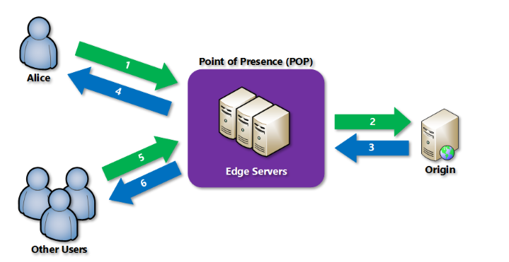

# Monitor, Troubleshoot and optimize Azure solutions

## Azure CDN

A content delivery network (CDN) is a distributed network of servers that can efficiently deliver web content to users. CDNs' store cached content on edge servers in point-of-presence (POP) locations that are close to end users, to minimize latency.



Requirements

- Azure subscription
- atleast 1 CDN profile, which is collection of CDN endpoints.
- CDN endpoints is existing web application.
- Caching rules are only available for the caching tiers of azure CDN standard from verizon and azure CDN standard from Akamai.
- Caching rules for entire profile or single end points

**Caching Behavior**
- Ignore the query strings - Default mode
- Bypass Caching for query string - If the query string is present then the request is sent directly to origin server.
- Cache every unique URL - Caches  evey unique url taking query string into account.


Example: Create a .net webapp. and configure Azure CDN Profile.

## Azure Redis Cache
- Fully managed service - Used to cache the frequently accessed data.
  
  **Pattern**
  1. Data cache
  2. Content Cache
  3. Session Store
  4. Job and Message queuing
  5. Distributed Transcations

https://docs.microsoft.com/en-us/azure/azure-cache-for-redis/cache-web-app-howto


```
# Deploy redis cache
New-AzRedisCache -ResourceGroupName myGroup -Name mycache -Location "North Central US" -RedisConfiguration @{"maxmemory-policy" = "allkeys-random", "notify-keyspace-events" = "KEA"}
```
```
##CacheSecrets.config
<appSettings>
    <add key="CacheConnection" value="<host-name>,abortConnect=false,ssl=true,allowAdmin=true,password=<access-key>"/>
</appSettings>

##App.config
<?xml version="1.0" encoding="utf-8" ?>
<configuration>
    <startup> 
        <supportedRuntime version="v4.0" sku=".NETFramework,Version=v4.7.2" />
    </startup>

    <appSettings file="C:\AppSecrets\CacheSecrets.config"></appSettings>
</configuration>

###
using StackExchange.Redis;
using System.Configuration;

## Program.cs
private static Lazy<ConnectionMultiplexer> lazyConnection = CreateConnection();

public static ConnectionMultiplexer **Connection**
{
    get
    {
        return lazyConnection.Value;
    }
}

private static Lazy<ConnectionMultiplexer> CreateConnection()
{
    return new Lazy<ConnectionMultiplexer>(() =>
    {
        string cacheConnection = ConfigurationManager.AppSettings["CacheConnection"].ToString();
        return ConnectionMultiplexer.Connect(cacheConnection);
    });
}


###
IDatabase  cache = connection.GetDatabase();

#String
cache.StringSet("Message","This is custom Message")
#Object
cache.Stringset("user",JSONConvert.SerliazeObject(obj));

#Getter
cache.StringGet("Message");
JsonConvert.DeserliazeObject<user>(cache.stringGet("user"));


```


## Application Insights

https://docs.microsoft.com/en-us/azure/azure-monitor/app/app-insights-overview

- Funnels - This can be used to see how well  application used.
- User flows
- Impact
- Retention


