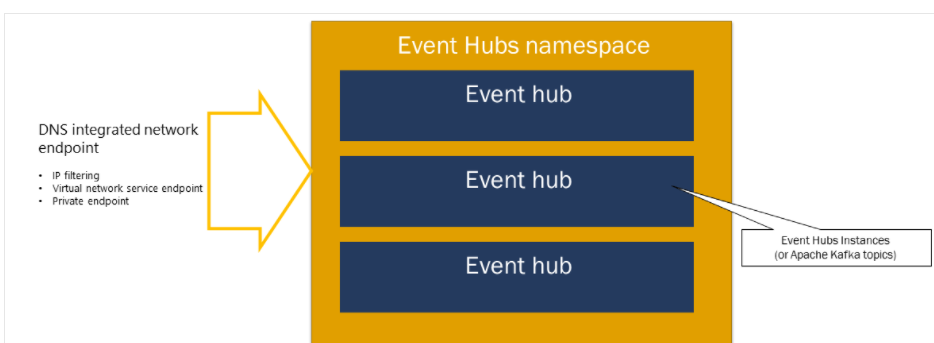
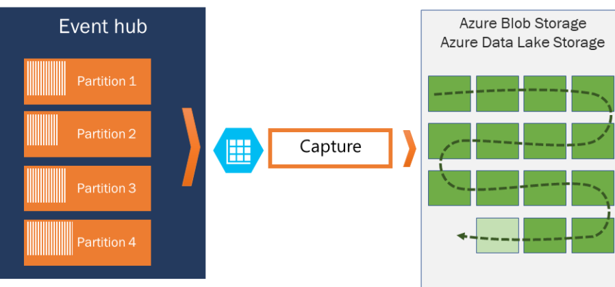
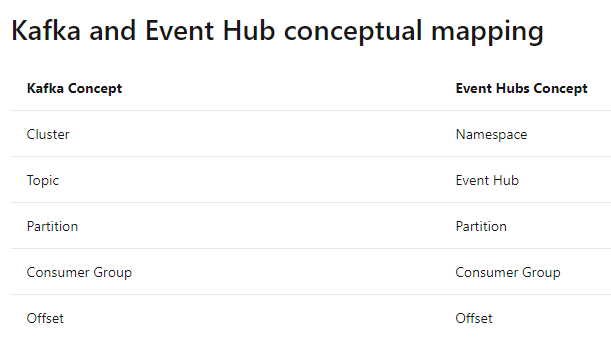

# Azure Services

# Azure API Management Services
- Define or import the API schema.
- Package API into the products.
- Each Product has a title, description and terms to use.
- 

**API Gateway**
- Accept API calls and route them to backends
- Verifies API Keys, JWT Tokens , Certificates and other credentials.
- Enforce quotas and rate limits.
- Transform API on fly without any code modifications.
- Caches Backednd and logs call metadata for anlytics purpose.

There are <span style="color:red">two</span>  Portals 
  1. **Azure portal**  
   - For administrative purpose. Define or import API Schema. 
   - Package API into the products. 
   - Setup policies like quotas or transformations on the APIs
  2.  **Developer portal**
   - Read API Documentation
   - Try out an API via interactive console
   - Create an account and subscribe to get API keys
   - Access analytics for own usage.
   
*Product* has set of APIs which has product, title and description and terms of use. It can be open or protected. If protected, Needs subscription before using.

**Groups**
- **Administrator** - Manage API Management service instances, create the APIs, operations and products that are used by the developers.
- **Developers** - The users in this group will have access to developer portal.
- **Guests** - These are the users who wan to view APIs.
  
*Pricing Details*
  - Developer, basic and standard


Create a blank API, Add a Frontend operation
Front end operation comes before input operation.

* operations: Frontend, Input and output operations.
Backend HTTP endpoint

## Management Policies
- Collection of the statemnets which can be applied to request or response of a API.
- There are different types of policies. 
  
#### **Access Restriction Policies**
- Ensure that the header contains particular value.
- Limit the call rate.
- Rstrict IPs

Authenticate an API call with a certificate, control the flow based on boolean expressions. Transformation policies like converting JSON to XML


# **Event Grid** 
   - Events - What happened.
   - Event sources - Where the event took place.
   - Topics - The endpoint where publishers send events.
   - Event subscriptions - The endpoint or built-in mechanism to route events, sometimes to more than one handler. Subscriptions are also used by handlers to intelligently filter incoming events.
   - Event handlers - The app or service reacting to the event.
**Event Grid also has support for your own events, using custom topics.**

```
# Create a custom topic
az eventgrid topic create --resource-group $myResourceGroup --name $myTopic --location westus2

# Retrieve endpoint and key to use when publishing to the topic
endpoint=$(az eventgrid topic show --name $myTopic -g $myResourceGroup --query "endpoint" --output tsv)
key=$(az eventgrid topic key list --name $myTopic -g $myResourceGroup --query "key1" --output tsv)


# Event subscription to the topic
az eventgrid event-subscription create --name <event-subscription-name> \
  --resource-group <resource group name> \
  --topic-name <topic name> \
  --subject-ends-with engineering \
  --included-event-type employeeAdded \
  --endpoint <function endpoint>
```
```
[
  {
    "topic": string,
    "subject": string,   
    "id": string,
    "eventType": string,
    "eventTime": string,
    "data":{
      object-unique-to-each-publisher
    }
  }
]

Ex:
[{
  "id": "30934",
  "eventType": "employeeAdded",
  "subject": "department/engineering",
  "eventTime": "2017-12-14T10:10:20+00:00",
  "data":{
    "employeeId": "14",
    "employeeName": "Nigel Tufnel",
    "employeeEmail": "nigel@contoso.com",
    "manager": "itmanager@contoso.com",
    "managerId": "4"
  }
}]
```


  # **Event hub**

An Event Hubs namespace is a management container for event hubs (or topics, in Kafka parlance)

Publish an event via AMQP 1.0, the Kafka protocol, or HTTPS. 

Publisher URL:
**https://<my namespace>.servicebus.windows.net/<event hub name>/publishers/<my publisher name>
**


-  Protocol HTTP and AMQP
-  Code Send events to and receive events from Azure Event Hubs - .NET 
-  
https://docs.microsoft.com/en-us/azure/event-hubs/event-hubs-dotnet-standard-getstarted-send

**Pricing Tier**


**Event Hub Capture**

Event Hubs Capture enables you to automatically capture the streaming data in Event Hubs and save it to your choice of either a Blob storage account, or an Azure Data Lake Storage account. You can enable capture from the Azure portal, and specify a minimum size and time window to perform the capture.





```
# Create an Event Hubs namespace. Specify a name for the Event Hubs namespace.
az eventhubs namespace create --name <Event Hubs namespace> --resource-group <resource group name> -l <region, for example: East US>

# Create an event hub. Specify a name for the event hub. 
az eventhubs eventhub create --name <event hub name> --resource-group <resource group name> --namespace-name <Event Hubs namespace>

```
Programming Eventhub


```
#packages
using System;
using System.Text;
using System.Threading.Tasks;
using Azure.Messaging.EventHubs;
using Azure.Messaging.EventHubs.Producer;
// connection string to the Event Hubs namespace
private const string connectionString = "<EVENT HUBS NAMESPACE - CONNECTION STRING>";

// name of the event hub
private const string eventHubName = "<EVENT HUB NAME>";

// number of events to be sent to the event hub
    private const int numOfEvents = 3;
    static EventHubProducerClient producerClient; 
static async Task Main()
    {
        // Create a producer client that you can use to send events to an event hub
        producerClient = new EventHubProducerClient(connectionString, eventHubName);

        // Create a batch of events 
        using EventDataBatch eventBatch = await producerClient.CreateBatchAsync();

        for (int i = 1; i <= numOfEvents; i++)
        {
            if (! eventBatch.TryAdd(new EventData(Encoding.UTF8.GetBytes($"Event {i}"))))
            {
                // if it is too large for the batch
                throw new Exception($"Event {i} is too large for the batch and cannot be sent.");
            }
        }

        try
        {
            // Use the producer client to send the batch of events to the event hub
            await producerClient.SendAsync(eventBatch);
            Console.WriteLine($"A batch of {numOfEvents} events has been published.");
        }
        finally
        {
            await producerClient.DisposeAsync();
        }
    }


```


# Application Messaging
- Azure storage queue

```
using System; // Namespace for Console output
using System.Configuration; // Namespace for ConfigurationManager
using System.Threading.Tasks; // Namespace for Task
using Azure.Storage.Queues; // Namespace for Queue storage types
using Azure.Storage.Queues.Models; // Namespace for PeekedMessage
```


```
QueueClient queueClient = new QueueClient(connectionString, queueName);

#Send Message
queueClient.SendMessage(message);

#Peek Message
 PeekedMessage[] peekedMessage = queueClient.PeekMessages();

#Receive Message
QueueMessage[] message = queueClient.ReceiveMessages();

#Update Message Contets
queueClient.UpdateMessage(message[0].MessageId, 
                message[0].PopReceipt, 
                "Updated contents",
                TimeSpan.FromSeconds(60.0)  // Make it invisible for another 60 seconds
            );
queueClient.DeleteMessage
```

- **Azure service bus**- It has namespace. Which should be unique. it has Basic, Standard and Premium


  99.9% uptime
  
  


 | Event Grid                                                                                                                                                                                                                                                                                                                                                                                                                                                                                                                                     | Event hub                           | Service Bus                                                                             | Storage Queue                                                                                                             |
|------------------------------------------------------------------------------------------------------------------------------------------------------------------------------------------------------------------------------------------------------------------------------------------------------------------------------------------------------------------------------------------------------------------------------------------------------------------------------------------------------------------------------------------------|-------------------------------------|-----------------------------------------------------------------------------------------|---------------------------------------------------------------------------------------------------------------------------|
| Event subscriptions Event handlers                                                                                                                                                                                                                                                                                                                                                                                                                                                                                                             | Partitions and Consumer Groups      | Queues, Topics, Subscriptions, rules  and filters                                       | Storage Account Queues                                                                                                    |
|  Durability: Azure Event Grid does not keep messages.  If there is no listening subscriber, events are lost.  Unless it is used with a webbook or a trigger subscriber,  it is advised to pair it with another message broker like Service Bus or Queue Storage;  otherwise, messages will be lost.                                                                                                                                                                                                                                            | Throughput Units Ingress and Egress | DLQ,  Duplicate Detection, Delivery Guarantee, Message ordering Pub/sub with pull model | Message Editing, Deletion and Security Consumption Mode: Pub/sub with pull mode and competing consumers Big queues: 80 GB |
| Consumption Mode:pub/sub with a push model,  concurrent consumers,  and partitioning can be achieved with event filtering. Event Schema: Events consist of a set of five required string properties and a  required data object: topic, subject, id, event type, and data.  The properties are common to all events from any publisher. The data object has properties that are specific to each publisher.  For system topics, these properties are specific to the resource provider, such as Azure Storage or Azure Event Hubs (Microsoft). |                                     |                                                                                         |                                                                                                                           |


