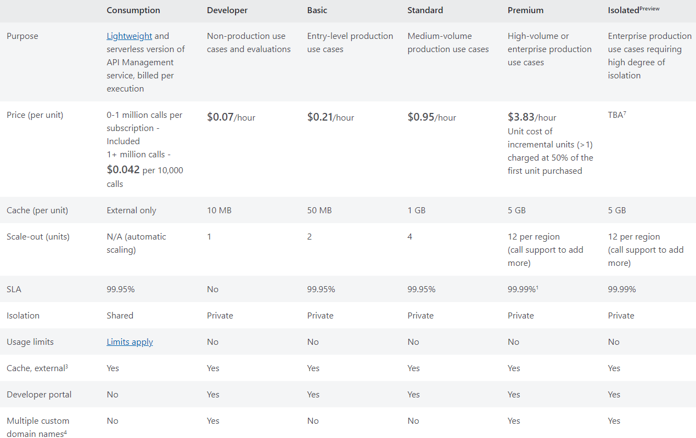
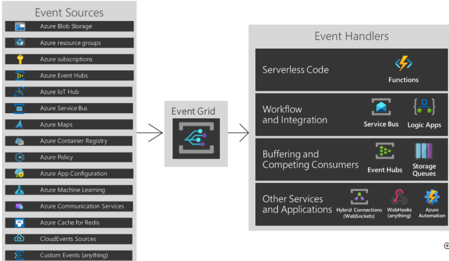
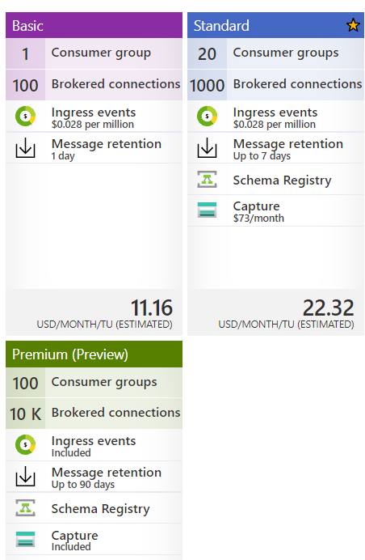
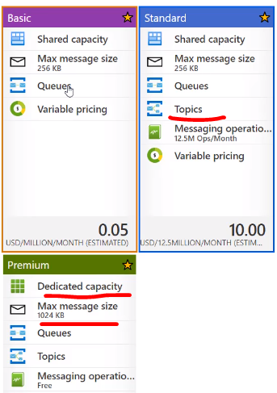

# Azure Services

# Azure API Management Services
- Define or import the API schema.
- Package API into the products.
- Each Product has a title, description and terms to use.
- 

**API Gateway**
- Accept API calls and route them to backends
- Verifies API Keys, JWT Tokens , Certificates and other credentials.
- Enforce quotas and rate limits.
- Transform API on fly without any code modifications.
- Caches Backednd and logs call metadata for anlytics purpose.

There are <span style="color:red">two</span>  Portals 
  1. **Azure portal**  
   - For administrative purpose. Define or import API Schema. 
   - Package API into the products. 
   - Setup policies like quotas or transformations on the APIs
  2.  **Developer portal**
   - Read API Documentation
   - Try out an API via interactive console
   - Create an account and subscribe to get API keys
   - Access analytics for own usage.
   
*Product* has set of APIs which has product, title and description and terms of use. It can be open or protected. If protected, Needs subscription before using.

**Groups**
- **Administrator** - Manage API Management service instances, create the APIs, operations and products that are used by the developers.
- **Developers** - The users in this group will have access to developer portal.
- **Guests** - These are the users who wan to view APIs.
  
*Pricing Details*
  - Developer, basic and standard


Create a blank API, Add a Frontend operation
Front end operation comes before input operation.

* operations: Frontend, Input and output operations.
Backend HTTP endpoint

## Management Policies
- Collection of the statemnets which can be applied to request or response of a API.
- There are different types of policies. 
  
#### **Access Restriction Policies**
- Ensure that the header contains particular value.
- Limit the call rate.
- Rstrict IPs

Authenticate an API call with a certificate, control the flow based on boolean expressions. Transformation policies like converting JSON to XML



# **Event Grid** 
   - Events - What happened.
   - Event sources - Where the event took place.
   - Topics - The endpoint where publishers send events.
   - Event subscriptions - The endpoint or built-in mechanism to route events, sometimes to more than one handler. Subscriptions are also used by handlers to intelligently filter incoming events.
   - Event handlers - The app or service reacting to the event.
**Event Grid also has support for your own events, using custom topics.**




  # **Event hub**
-  Protocol HTTP and AMQP
-  Code Send events to and receive events from Azure Event Hubs - .NET 
-  
https://docs.microsoft.com/en-us/azure/event-hubs/event-hubs-dotnet-standard-getstarted-send

**Pricing Tier**




# Application Messaging
- Azure storage queue

```
using System; // Namespace for Console output
using System.Configuration; // Namespace for ConfigurationManager
using System.Threading.Tasks; // Namespace for Task
using Azure.Storage.Queues; // Namespace for Queue storage types
using Azure.Storage.Queues.Models; // Namespace for PeekedMessage
```


```
QueueClient queueClient = new QueueClient(connectionString, queueName);

#Send Message
queueClient.SendMessage(message);

#Peek Message
 PeekedMessage[] peekedMessage = queueClient.PeekMessages();

#Receive Message
QueueMessage[] message = queueClient.ReceiveMessages();

#Update Message Contets
queueClient.UpdateMessage(message[0].MessageId, 
                message[0].PopReceipt, 
                "Updated contents",
                TimeSpan.FromSeconds(60.0)  // Make it invisible for another 60 seconds
            );
queueClient.DeleteMessage
```

- **Azure service bus**- It has namespace. Which should be unique. it has Basic, Standard and Premium


  99.9% uptime
  
  


 | Event Grid                                                                                                                                                                                                                                                                                                                                                                                                                                                                                                                                     | Event hub                           | Service Bus                                                                             | Storage Queue                                                                                                             |
|------------------------------------------------------------------------------------------------------------------------------------------------------------------------------------------------------------------------------------------------------------------------------------------------------------------------------------------------------------------------------------------------------------------------------------------------------------------------------------------------------------------------------------------------|-------------------------------------|-----------------------------------------------------------------------------------------|---------------------------------------------------------------------------------------------------------------------------|
| Event subscriptions Event handlers                                                                                                                                                                                                                                                                                                                                                                                                                                                                                                             | Partitions and Consumer Groups      | Queues, Topics, Subscriptions, rules  and filters                                       | Storage Account Queues                                                                                                    |
|  Durability: Azure Event Grid does not keep messages.  If there is no listening subscriber, events are lost.  Unless it is used with a webbook or a trigger subscriber,  it is advised to pair it with another message broker like Service Bus or Queue Storage;  otherwise, messages will be lost.                                                                                                                                                                                                                                            | Throughput Units Ingress and Egress | DLQ,  Duplicate Detection, Delivery Guarantee, Message ordering Pub/sub with pull model | Message Editing, Deletion and Security Consumption Mode: Pub/sub with pull mode and competing consumers Big queues: 80 GB |
| Consumption Mode:pub/sub with a push model,  concurrent consumers,  and partitioning can be achieved with event filtering. Event Schema: Events consist of a set of five required string properties and a  required data object: topic, subject, id, event type, and data.  The properties are common to all events from any publisher. The data object has properties that are specific to each publisher.  For system topics, these properties are specific to the resource provider, such as Azure Storage or Azure Event Hubs (Microsoft). |                                     |                                                                                         |                                                                                                                           |


