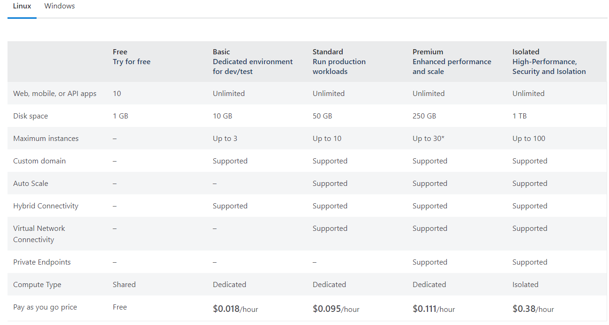

# Azure Web APP

**Webappservice Plan** - Provides underlying linux or windows infrastructure to run web applications.



**Web App** - Provides java or .net application environment to run the applications.


It is platform as service.

Appservice Plan

```
az group create -g MyResourceGroup --location westeurope

az appservice plan create -gMyResourceGroup -n MyWindowsPlan --sku B1

az webapp create -g MyResourceGroup -p MyWindowsPlan -n MyUniqueAppName1015

  ```
