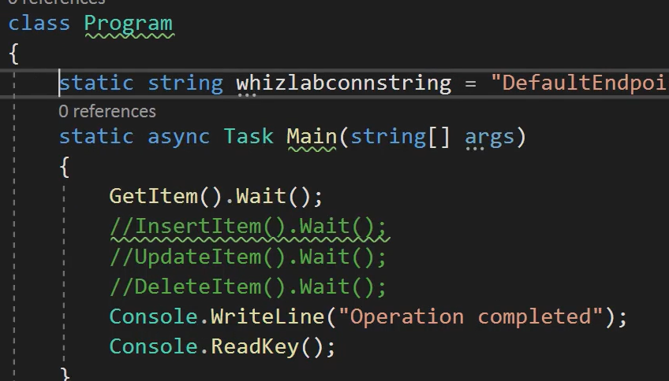

# Cosmos

SQL API

You can create multiple databases in cosmos DB account.

each database can have multiple collection ids.

each collectionid has partition key

**Throughput**

- Throughput is combined measured of CPU, Memory, IOPS
- It  is same across any API you choose.
-  The throughput is measured in reaquest units.
-  The cost to read a 1 kb item is 1 request unit.
-  Billing is done in hourly basis.

**Working with SQL API**
- The azure cosmos  DB SQL API allows one to query JSON documents using structured query language.
- Data is stored as documents when you use the SQL API
-  Information is collected into databases, Collections and Documents.
-  Parition key is use partiton the cosmos DB.
-  Each item in a container in a database contains an item iD.
-  The partiton key and item ID helps to create the item index which helps to uniquely identify the item.

**API**
- Core SQL - SQL API- Called Documents
- MongoDB
- Cassandra
- Azure table - Table API - Called Entities
- Gremlin

Cassandra - Column based structure.
Gremlin - Graph based structure.

SQL API. 
in a database, we have container. Container is nothing but a table.

Table API
- Partition Key and Row Key
- Partition key - property used to partition data.
- Rowkey - property used to uniquely identify data.
  


# **Create cosmos DB using Azure CLI**

> az cosmos create --g <Resource-group> -- default -consitenty-level {BoundedStaleness, ConsistentPrefix Eventual, Session,Strong} --kind {GlobalDocumentDB, MongoDB, Parse}

Ex:
```
az cosmosdb create --name <cosmosdbname> --resource-group <resourcegroup-name> --default-consistency-level Eventual --kind GlobalDocumentDB
```


```
# Set variables for the new SQL API account, database, and container
resourceGroupName='myResourceGroup'
location='southcentralus'

# The Azure Cosmos account name must be globally unique, so be sure to update the `mysqlapicosmosdb` value before you run the command
accountName='mysqlapicosmosdb'

# Create a resource group
az group create \
    --name $resourceGroupName \
    --location $location

# Create a SQL API Cosmos DB account with session consistency and multi-region writes enabled
az cosmosdb create \
    --resource-group $resourceGroupName \
    --name $accountName \
    --kind GlobalDocumentDB \
    --locations regionName="South Central US" failoverPriority=0 --locations regionName="North Central US" failoverPriority=1 \
    --default-consistency-level "Session" \
    --enable-multiple-write-locations true
```


# Consistency levels

Replica sets
- Strong
- Bounded Staleness
- Session
- Conistent Prfix
-  Eventual




https://docs.microsoft.com/en-us/azure/cosmos-db/sql/sql-api-dotnet-application


**Create containers using Command line**


You can create multiple physical parittions based on couple of factors.
 Throughput settings: each partition allows for 10k ru/s
 Storage: Each partition has maz size of 50 GB.

```
Classes related to cosmos
1. New cosmos client  Cosmosclient db= new CosmosClient(endpoint, accountkeys)
2. Database db= client.GetDatabase(databaseid)
3. Container container = db.GetContainer(containerid)
4. Itemresponse<Customer> response = await container.ReadItemsAsync<Customer>(partitionkey, id) --  **reading**
5. Itemresponse<Customer> response = await container.CreateItemsAsync(obj) -- **Write.**
6. Itemresponse<Customer> response = await container.ReplaceItemsAsync(id:obj.id,item:obj); -**Replace**
7.  ItemResponse<Customer> response = await container.DeleteItemAsync<Customer>(
                    partitionKey: new PartitionKey("New York"), -- **Delete**
8. response.RequestCharge
9. Customer obj = (customer)response; [obj.id, obj.customername,obj.customercity]
```
# Stored Procedure
 ***context object*** provides access to all operations that can be performed in Azure Cosmos DB, as well as access to the request and response objects. 

```
var helloWorldStoredProc = {
    id: "helloWorld",
    serverScript: function () {
        var context = getContext();
        var response = context.getResponse();

        response.setBody("Hello, World");
    }
}
# calling stored procedure

 var procs = container.Scripts;
var key = new PartitionKey(string.Empty);
 var result=await procs.ExecuteStoredProcedureAsync<string>("starter",key, null);
starter is name of the stored proc.
   dynamic[] newItems = new dynamic[]
                    {
                    new {
                    id = "10",
                    city = "Chicago",
                    customername="Joe"                    
                        }
                    };
var key = new PartitionKey("Joe");
var result = await procs.ExecuteStoredProcedureAsync<string>("newitem", key, newItems);
Console.WriteLine(result.Resource);
newitem is name of the stored proc

# new item store proc
function createToDoItem(itemToCreate) {

    var context = getContext();
    var container = context.getCollection();

    var accepted = container.createDocument(container.getSelfLink(),
        itemToCreate,
        function (err, itemCreated) {
            if (err) throw new Error('Error' + err.message);
            context.getResponse().setBody(itemCreated.id)
        });
    if (!accepted) return;
```

### Trigger

Azure Cosmos DB supports pre-triggers and post-triggers. Pre-triggers are executed before modifying a database item and post-triggers are executed after modifying a database item. Triggers are not automatically executed, they must be specified for each database operation where you want them to execute. 

```
Trigger:
function trigger(){
var context=getContext();
var request=context.getRequest();
var doc=request.getBody();

doc["type"]="New Customer";
request.setBody(doc);
}

await container.CreateItemAsync(customer, null, new ItemRequestOptions { PreTriggers = new List<string> { "demotrigger" } });
```


### Change Feed
- It will listens to all changes with in a particular container.
- Gives a sorted list of documents that were changed in the order in which they are modified.
- There is no support for table API. Filter change feed based on certain type of operation.
- it will not log deletes. to capture delete we must have soft-delete flag set.

### Stored Procedure

- Store proc can be used to perform an operation on a cosmos DB
- It is written in java script.
- Registered and executed against collection and runs as asingle transcation.
- 


 # Storage accounts

 - **General purpose V2** - Blob, File, Table and queue
 - **General purpose V1** - Legacy
 - **Block blob storage accounts** - these are the storage accounts that provide premium performance when it comes to storing block and appened blobs.
 -  **File storage accounts** -  These are storage accounts that provide permium performance when it comes to storing files.
 -  **BlockStorage accounts** - This is a legacy blob-only storage accounts
  
  **General Purpose v2 account - Blob service** - This is used to store images, audio, video and unstructured data

  **General purpose V2 account - File storage** - This is used to create file share can be accessed via SMB protocol. You can mount on windows oS.

   **General purpose V2 Account - Table service** - NoSQL Data in the cloud
   - Ideal for the storage accessed by the web applications.
   - it is ideal for datasets that will not require complex joins.
  
**General purpose V2 Account - Queue service** - This is a service that can be used to storing large number of messages to be shared across the component of the application


# Azure CLI with blob storage

```
az storage account create --name <Account-NAME> --resource-group <RESOURCE-GROUP-NAME> --location EastUS --sku Standard_LRS 

az storage container create --account-name <Account-NAME> --name data

echo This is a sample html file > sample.html

az storage blob upload --account-name <Account-NAME> --container-name data --name sample.html --file sample.html

az storage container set-permission --account-name <Account-NAME> --name data --public-access blob

az storage blob list --account-name <Account-NAME> --container-name data  --output table

az storage blob download --account-name <Account-NAME> --container-name data --name sample.html --file sample2.html
```

Download AZcopy Binary: https://docs.microsoft.com/en-us/azure/storage/common/storage-use-azcopy-v10


**AZ Copy Commands**


```
az login --tenant-id=<tenant-id>
azcopy make "https://<Storage-account-name>.blob.core.windows.net/<container-name>"

az copy <source> <destination>

azcopy copy "dummy.html" "https://<Storage-account-name>.blob.core.windows.net/<container-name>/dummy1.html"

azcopy copy "https://<Storage-account-name>.blob.core.windows.net/<container-name>/dummy1.html" "dummy2.html"
```

# Data Retention and archival


# Create Blob Container programatically

Packages: Azure.storage.blobs and azure.storage.blobs.models

Connection string: 

```
BlobServiceClient blobServiceClient = new BlobServiceClient(connstring);

#Create Blobcontainer
BlobContainerClient containerClient = await blobServiceClient.**CreateBlobContainerAsync**(containerName);

# Get handle for new blob in the container
BlobClient blobClient = containerClient.GetBlobClient(blobfilename);

#Upload the local file to a file stream
using FileStream uploadFileStream = File.OpenRead(filepath);

#upload the blob to container.
await blobClient.**UploadAsync**(uploadFileStream, true);
uploadFileStream.Close();


#List blobs
BlobServiceClient blobServiceClient = new BlobServiceClient(connstring);
BlobContainerClient containerClient = blobServiceClient.GetBlobContainerClient(containerName);

 await foreach (BlobItem blobItem in containerClient.GetBlobsAsync())
            {
                Console.WriteLine("\t" + blobItem.Name);
            }

#Download blob
BlobServiceClient blobServiceClient = new BlobServiceClient(connstring);
BlobContainerClient containerClient = blobServiceClient.GetBlobContainerClient(containerName);
BlobClient blob = containerClient.GetBlobClient(filename);
BlobDownloadInfo blobdata = await blob.DownloadAsync();

 using (FileStream downloadFileStream = File.OpenWrite(downloadpath))
            {
                await blobdata.Content.CopyToAsync(downloadFileStream);
                downloadFileStream.Close();
            }


```


# Programatically manage Storage Properties

```

# Create a connection to the storage account
 BlobServiceClient blobServiceClient = new BlobServiceClient(connstring);

# Get a handle to an existing container
 BlobContainerClient containerClient = blobServiceClient.GetBlobContainerClient(containerName);

# Get a handle to the blob
 BlobClient blob = containerClient.GetBlobClient(filename);

#Get the Blob properties
BlobProperties properties=blob.GetProperties();
Console.WriteLine("The Content Type is {0}",properties.ContentType);
Console.WriteLine("The Content Length is {0}", properties.ContentLength);


#Get the metadata properties
foreach(var metadata in properties.Metadata)
            {
                Console.WriteLine(metadata.Key.ToString());
                Console.WriteLine(metadata.Value.ToString());
            }

# set the metadata properties
# Create an IDictionary object with the required values

IDictionary<string, string> metadata = new Dictionary<string, string>();
metadata.Add(key, value);

#Set the metadata properties
await blob.SetMetadataAsync(metadata);
```


## SAS URL Programming

```
# Get Shared access signature.
BlobSasBuilder sasBuilder = new BlobSasBuilder()
            {
                BlobContainerName = containerName,
                BlobName = blobname,
                Resource = "b",
                StartsOn = DateTimeOffset.UtcNow,
                ExpiresOn = DateTimeOffset.UtcNow.AddHours(1) // The SAS is only valid for an hour
            };

# specify the read permissions for the blob
sasBuilder.SetPermissions(BlobSasPermissions.Read);

#Create an object of StorageSharedKeyCredential using the account name and account key
 var storageSharedKeyCredential = new StorageSharedKeyCredential(accountname,accountkey);

 #get the SAS token
 string sasToken = sasBuilder.ToSasQueryParameters(storageSharedKeyCredential).ToString();

 #Build the full URI to the Blob SAS
      UriBuilder fullUri = new UriBuilder()
            {
                Scheme = "https",
                Host = string.Format("{0}.blob.core.windows.net", accountname),
                Path = string.Format("{0}/{1}", containerName, blobname),
                Query = sasToken
            };


```


