Manage your systems.

1. Path

Azure basics backup 

update managemet:
log analytics workspace.

https://docs.microsoft.com/en-us/learn/modules/intro-to-azure-virtual-machines/

ARM Templates
- Azure Portal
- CLI
- Powershell
- Rest API
- Github
- Cloud Shell

ARM templates has 8  JSON elements

- Schema
- apiProfile
- Parameters
- Variables
- functions
- resources
- outputs 

Three are mandatory 
- Schema
- content version
- resources

VS code or virtual studio
- subscrption group deployments
- management group deployments
- tenant based deploymenets

$schema - controls the zure template version youll be using to deploy from. 

contenet version is a value you define that helps keep track of the completed tempale version.

resources

Five optional elements
- parameters  - used to store service parameters to be sued during deployments
    - useful for creating deployment constraints
    - Ensure consistency in objects to be deployed via default values and locations
    
- Variables: Used to create and define variables for use throughout the template script
    - great for storing long values or objects for reuse in the script.

-  Functions - create user defined functions to be used throughout your template

- outputs - returns values from deployed resources.

https://docs.microsoft.com/en-us/learn/modules/control-and-organize-with-azure-resource-manager/

Containers
Create containers using azure cli command.

Azure CLI: az container create
Powershell: New-AZcontainer

https://docs.microsoft.com/en-us/learn/modules/control-and-organize-with-azure-resource-manager/

Create container registry
az acr create -- resource-group <RGNAME> --name  <NAME>  \
--sku Basic

--login-server

Log into Repository

az acr login /
--name <Name of the registry we are trying to login>

Tag before you push.

docker tag <path to image/your image>  <loginservername/name of the image:version>

docker tag c:/user/gamemaster/204imge azuredale registry.acr.io/204image:v1

docker push azuredale registry.acr.io/204image:v1

List the images

az acr repository list --name azuredalte container204 --output table

 https://docs.microsoft.com/en-us/learn/modules/deploy-run-container-app-service/

Free, Dev/Test is only for windows.

SKU: Web appservice plan.
Free and test.
No linux for shared tiers.

Enable Diag
- Storage account is requied for contiuous loggging
- Logs can be reviewed using either applciation insights, log analytics or azure monitor.

- Deploy code to the webapp.

Functions can be run as their own or it can be run as webapp service plan.

Webappsevice plan
webapp or webapp service
Deploy code.

Functions are essentially just big IF this then do that statement that are really powerful and can work across azure services.

- Implement input and output binding for a functions
- Deploy and configure function triggers by a using data opertations, timers and webhooks
- Duarable function.

Three plans

- Consumption based - serverless
- premium
- app service plan

Trigger and binding needed for function 
- Trigger(IF) - Webhook, scheduled process, data 
- Input - Inputs consists of data you want to use for the output , such as data altered in blob storage or a message queue
- ouptut are the result of the function. this is where data gets updated based on your function purpose. this is where magic happens

Function Redux

Durable functions are an extension that allows for the creation of stateful functions.

Function Chaining
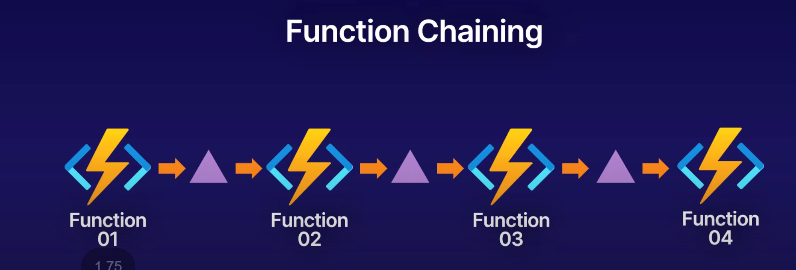

Fanout out/in

Custom handlers are samll webservers that retrive events from a functions host. if the langusage supports http primitives it can use custom handler.

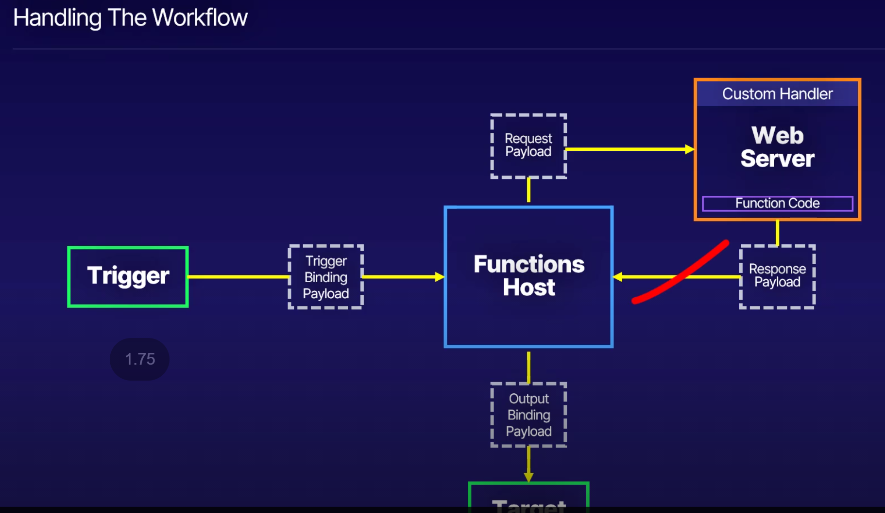

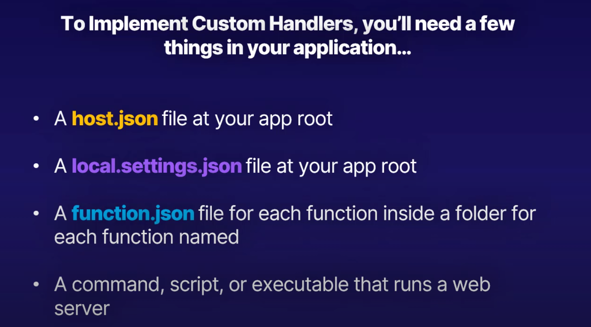

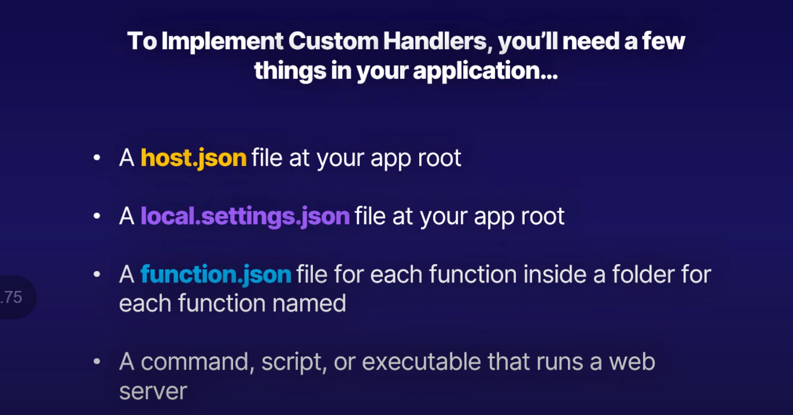

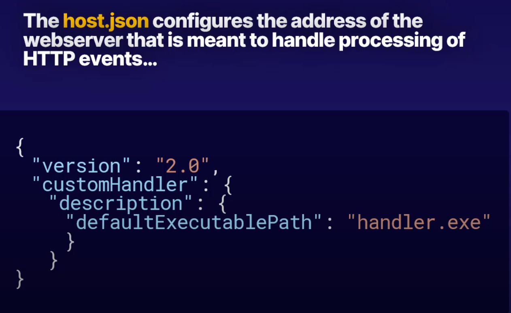

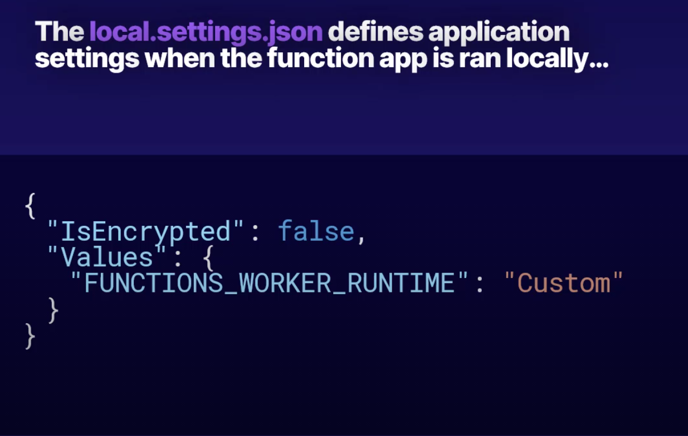

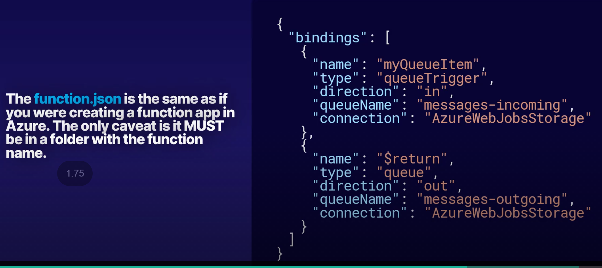

https://docs.microsoft.com/en-us/learn/modules/develop-test-deploy-azure-functions-with-visual-studio/

# Choose best Azure service 

Business processes modeled in software are often called workflows. Azure includes four different technologies that you can use - [Choose best Azure service](#choose-best-azure-service)to build and implement workflows that integrate multiple systems:

- Logic Apps
- Microsoft Power Automate
- WebJobs
- Azure Functions

These four technologies have some similarities. For example:

- They can all accept **inputs**. An input is a piece of data or a file that is supplied to the workflow.
- They can all run **actions**. An action is a simple operation that the workflow executes and may often modify data or cause another action to be performed.
- They can all include **conditions**. A condition is a test, often run against an input, that may decide which action to execute next.
- They can all produce **outputs**. An output is a piece of data or a file that is created by the workflow.

**Design-first** 
- Microsoft power automate - End users
- Logic app - Developers

**Code-First**
-  Webjobs 
-  Azure functions

**Webjobs** - Continuous. Run in a continuous loop. For example, you could use a continuous WebJob to check a shared folder for a new photo. 

Triggered. Run when you manually start them or on a schedule.

**Azure** **Functions**

HTTPTrigger. When you want the code to execute in response to a request sent through the HTTP protocol.

TimerTrigger. When you want the code to execute according to a schedule.

BlobTrigger. When you want the code to execute when a new blob is added to an Azure Storage account.

CosmosDBTrigger. When you want the code to execute in response to new or updated documents in a NoSQL database.

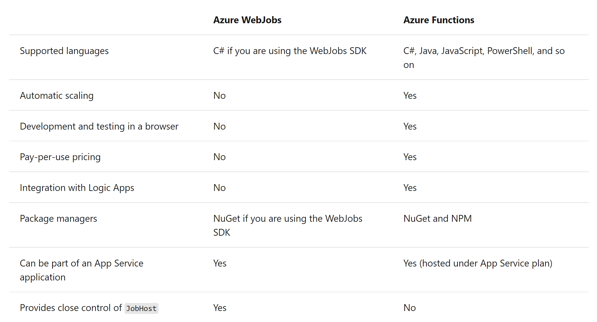

Decide what to use.

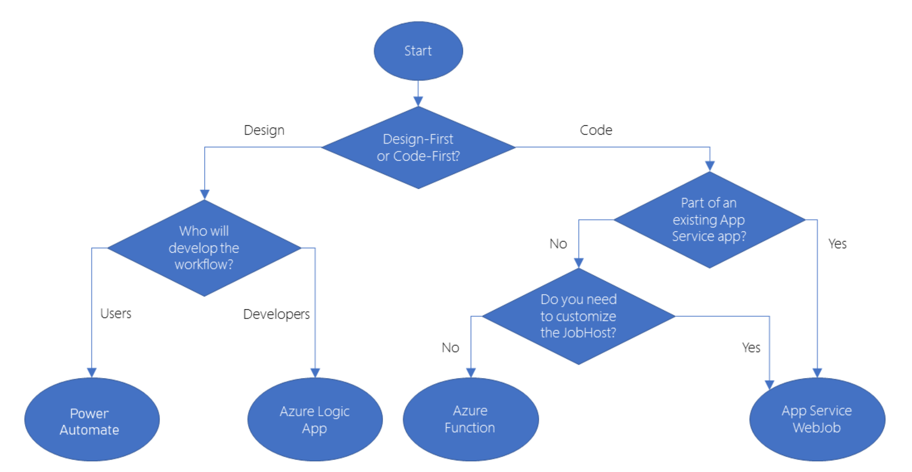

Triggers Input and output Binding

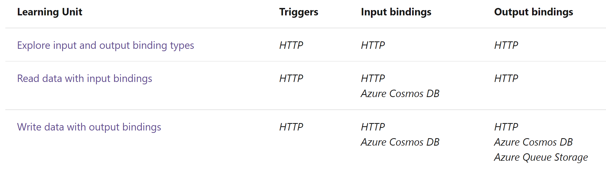

# Durable Function

Durable Functions enables you to implement complex **stateful** functions in a serverless-environment.

Durable Functions is an extension of **Azure** **Functions**. Whereas Azure Functions operate in a **stateless** environment, Durable Functions can retain state between function calls. This approach enables you to simplify complex stateful executions in a serverless-environment.

Durable functions allows you to define stateful workflows using an orchestration function. An **orchestration** **function** provides these extra benefits:

THree durable function types: ****Client**, **Orchestrator**, and **Activity**.
**

## Function Types

Client functions are the entry point for creating an instance of a Durable Functions orchestration. They can run in response to an event from many sources, such as a new HTTP request arriving, a message being posted to a message queue, an event arriving in an event stream. You can write them in any of the supported languages.

Orchestrator functions describe how actions are executed, and the order in which they are run. You write the orchestration logic in code (C# or JavaScript).

Activity functions are the basic units of work in a durable function orchestration. An activity function contains the actual work performed by the tasks being orchestrated.

Application patterns
- **Function chaining** - In this pattern, the workflow executes a sequence of functions in a specified order. The output of one function is applied to the input of the next function in the sequence. The output of the final function is used to generate a result.

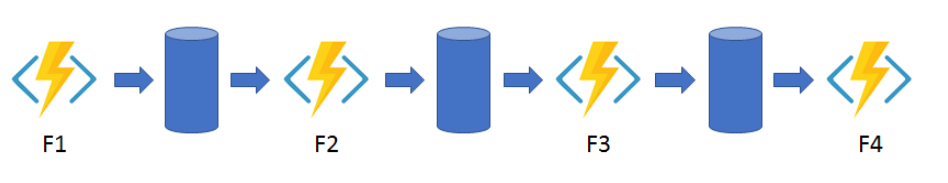
- **Fan out/fan in** - This pattern runs multiple functions in parallel and then waits for all the functions to finish. The results of the parallel executions can be aggregated or used to compute a final result.
- 
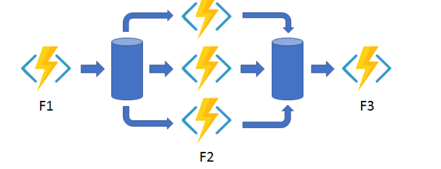

**Async HTTP APIs** - This pattern addresses the problem of coordinating state of long-running operations with external clients. An HTTP call can trigger the long-running action. Then, it can redirect the client to a status endpoint. The client can learn when the operation is finished by polling this endpoint.

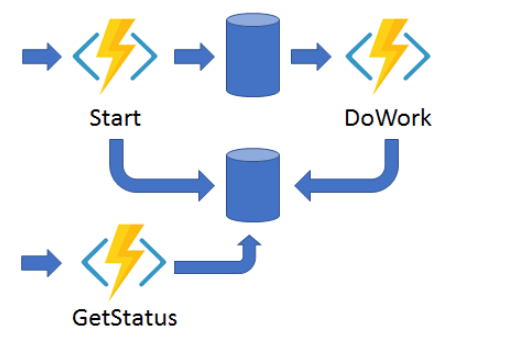
- **Monitor** - This pattern implements a recurring process in a workflow, possibly looking for a change in state. For example, you could use this pattern to poll until specific conditions are met.

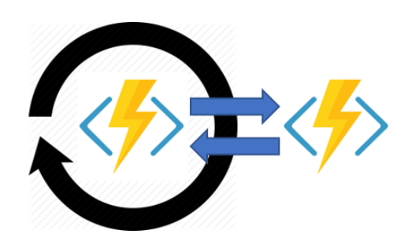

**Human interaction** - This pattern combines automated processes that also involve some human interaction. A manual process within an automated process is tricky because people aren't as highly available and as responsive as most computers. Human interaction can be incorporated using timeouts and compensation logic that runs if the human fails to interact correctly within a specified response time. An approval process is an example of a process that involves human interaction.

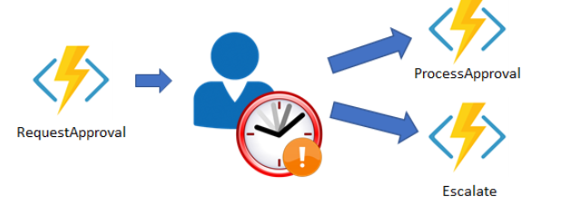

Comparisons of logic app.

Durable Functions and Logic Apps are both Azure services that enable serverless workload. Azure Durable Functions is intended as a powerful serverless compute option to run custom logic. Azure Logic Apps is better suited for integrating Azure services and components. You can use either technology to create complex orchestrations. With Azure Durable Functions, you develop orchestrations by writing code and using the Durable Functions extension. With Logic Apps, you create orchestrations by using the design surface or editing configuration files.

The following table lists some of the key differences between Azure Durable Functions and Azure Logic Apps.

|Task|Azure Durable Functions|Azure Logic Apps|
|--- |--- |--- |
|Development|Code-first (imperative)|Design-first (declarative)|
|Connectivity|About a dozen built-in binding types. You can write code for custom bindings.|Large collection of connectors. Enterprise Integration Pack for B2B. You can also build custom connectors.|
|Actions|Each activity is an Azure Function. You write the code for activity functions.|Large collection of ready-made actions. You integrate custom logic through custom connectors.|
|Monitoring|Azure Application Insights|Azure portal,  Azure Monitor logs|
|Management|REST API, PowerShell, Visual Studio|Azure portal,  REST API,  PowerShell,  Visual Studio, Visual Studio Code extension|

