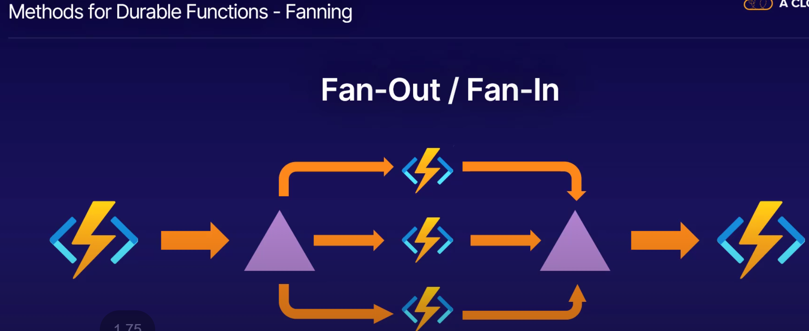

Manage your systems.

1. Path

Azure basics backup 

update managemet:
log analytics workspace.

https://docs.microsoft.com/en-us/learn/modules/intro-to-azure-virtual-machines/

ARM Templates
- Azure Portal
- CLI
- Powershell
- Rest API
- Github
- Cloud Shell

ARM templates has 8  JSON elements

- Schema
- apiProfile
- Parameters
- Variables
- functions
- resources
- outputs 

Three are mandatory 
- Schema
- content version
- resources

VS code or virtual studio
- subscrption group deployments
- management group deployments
- tenant based deploymenets

$schema - controls the zure template version youll be using to deploy from. 

contenet version is a value you define that helps keep track of the completed tempale version.

resources

Five optional elements
- parameters  - used to store service parameters to be sued during deployments
    - useful for creating deployment constraints
    - Ensure consistency in objects to be deployed via default values and locations
    
- Variables: Used to create and define variables for use throughout the template script
    - great for storing long values or objects for reuse in the script.

-  Functions - create user defined functions to be used throughout your template

- outputs - returns values from deployed resources.

https://docs.microsoft.com/en-us/learn/modules/control-and-organize-with-azure-resource-manager/

Containers
Create containers using azure cli command.

Azure CLI: az container create
Powershell: New-AZcontainer

https://docs.microsoft.com/en-us/learn/modules/control-and-organize-with-azure-resource-manager/

Create container registry
az acr create -- resource-group <RGNAME> --name  <NAME>  \
--sku Basic

--login-server

Log into Repository

az acr login /
--name <Name of the registry we are trying to login>

Tag before you push.

docker tag <path to image/your image>  <loginservername/name of the image:version>

docker tag c:/user/gamemaster/204imge azuredale registry.acr.io/204image:v1

docker push azuredale registry.acr.io/204image:v1

List the images

az acr repository list --name azuredalte container204 --output table

 https://docs.microsoft.com/en-us/learn/modules/deploy-run-container-app-service/

Free, Dev/Test is only for windows.

SKU: Web appservice plan.
Free and test.
No linux for shared tiers.

Enable Diag
- Storage account is requied for contiuous loggging
- Logs can be reviewed using either applciation insights, log analytics or azure monitor.

- Deploy code to the webapp.

Functions can be run as their own or it can be run as webapp service plan.

Webappsevice plan
webapp or webapp service
Deploy code.

Functions are essentially just big IF this then do that statement that are really powerful and can work across azure services.

- Implement input and output binding for a functions
- Deploy and configure function triggers by a using data opertations, timers and webhooks
- Duarable function.

Three plans

- Consumption based - serverless
- premium
- app service plan

Trigger and binding needed for function 
- Trigger(IF) - Webhook, scheduled process, data 
- Input - Inputs consists of data you want to use for the output , such as data altered in blob storage or a message queue
- ouptut are the result of the function. this is where data gets updated based on your function purpose. this is where magic happens

Function Redux

Durable functions are an extension that allows for the creation of stateful functions.

Function Chaining

Fanout out/in

Custom handlers are samll webservers that retrive events from a functions host. if the langusage supports http primitives it can use custom handler.

https://docs.microsoft.com/en-us/learn/modules/develop-test-deploy-azure-functions-with-visual-studio/

