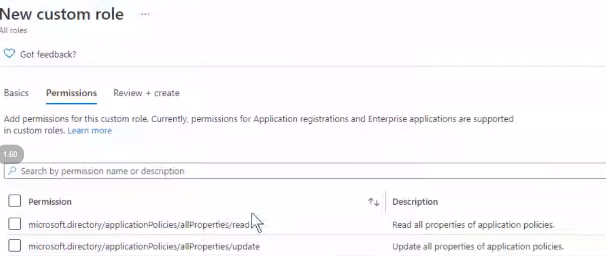
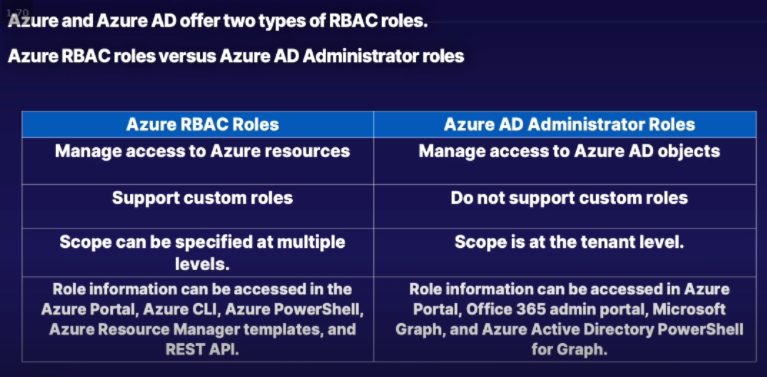
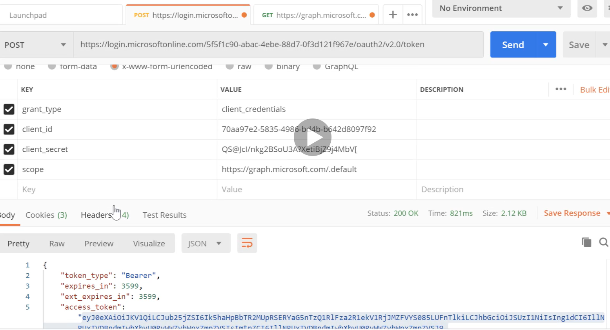
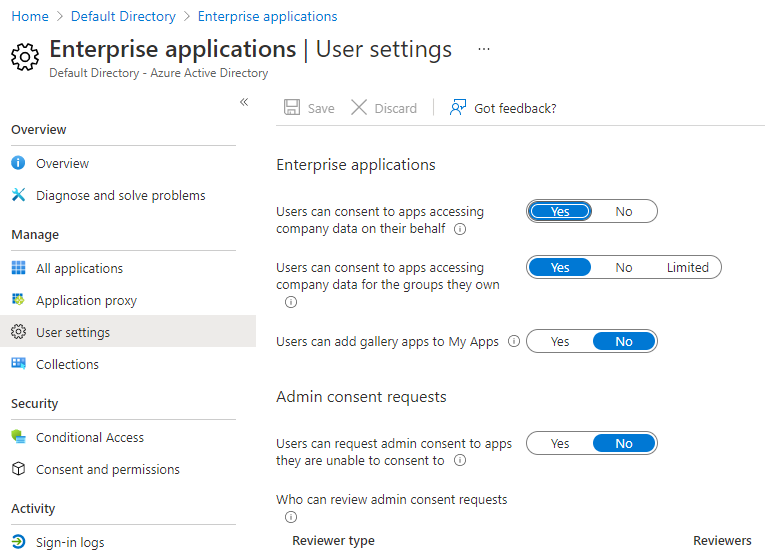

# Important Resources
-  [Exam AZ-500: Microsoft Azure Security Technologies](https://docs.microsoft.com/en-us/learn/certifications/exams/az-500)
- [Skills Guide](https://query.prod.cms.rt.microsoft.com/cms/api/am/binary/RE3VC70)
- [AZ 500:Crash Course-Timwarner](https://learning.oreilly.com/live-events/exam-az-500-microsoft-azure-security-technologies-crash-course/0636920360612/0636920056763/) --> Requires Oreily Subscription
- [AZ500: Linux Academy](https://linuxacademy.com/cp/modules/view/id/367)

## Microsoft Learning Path

- [secure-your-cloud-apps](https://docs.microsoft.com/en-us/learn/paths/secure-your-cloud-apps/)

---

Azure Active Directory. --> Premium Licenses

### Hybrid Authentication: 

Have applications in cloud use  AAD but users are located in active directory.  This requires bringing the users from local on prem AD to AAD. **Azue AD Connect**  --> TLS 443 connection

Custom Role:

Check Microsoft Graph API

**Provider/Feature/subfeature/\<crud\>**

## **Azure AD roles**
Use Azure AD roles to manage Azure AD-related resources like users, groups, billing, licensing, application registration, and more. To add or delete users from your Azure Active Directory (Azure AD) organization, you must be a User administrator or Global Administrator.

- Users
- Groups
- Applications
- Service Principal

Scoped at tenant level.

- Application Administrator: Ability to register all applications registrations
- Application Developer: Dev: Ability to register **their** applications registrations
- Groups Administrators: Manage groups in AAD
- Global Administraor
- Billing Administraor
- **User Administrator**
- **Password Administrator**

### **Azure Active Directory Group Types**
- Security: Shared resources for a group of users.
- Micorsoft 365: used to give members access to a shared mailbox calender etc.

### **Group Membership Types**:
- Assigned
- Dynamic Device --> Via Device attribute
- Dynamic user --> via user attribute

**RBAC** : Manage Authorization to use Azure resources. Can be given at

- Management Group
- Subscription Level
- Resource Group
- Resource

Example: Owner, Contributor, User access admin

- **[AzureBuiltin Roles](https://docs.microsoft.com/en-us/azure/role-based-access-control/built-in-roles)**
- **[Azure AD Built in Roles](https://docs.microsoft.com/en-us/azure/active-directory/roles/permissions-reference)**

Azure AD Roles Assignment to a user

1. Eligible
2. Active

Restore deleted users needs one of below priv

1.  Global Admin
2.  User Admin
3.  Partner Tier 1 and 2 support.

_Only office 365 groups can be  restored._

# App Registrations.
- Create app registration, to get client id, Client secret, scope
- Create a secret and copy the value which can be seen only once
- Assign API permissions.
  - Delegated Permissions: Runs behalf of a user
  - Applications Permissions: Runs behalf of the applications

-  **Provide Admin Consent**
- Call the microsoft authentication service
- Get an access token

**Use the Auth token from above to get the information from application**

- Access a resource using access token

## Application level Permissions
---
- Any uder can create applcaitons in Azure AD and manage all aspects of the application created
- It can be restricted by disabling app registration on user profile.
- Owners can be assigned to application. Who can manage the applications
-- **Application developer** cannot manage enterprise applications. Members of this group are added as owners of the application in azure AD.

-- **Application Administrator** can manage all aspects of enterprise applications, application registrations and application proxy settings. The users in this group are not added as owner when creating new application registrations
- **cloud administrator** - Similar to application admin, but cannot manage the application proxy feature.

